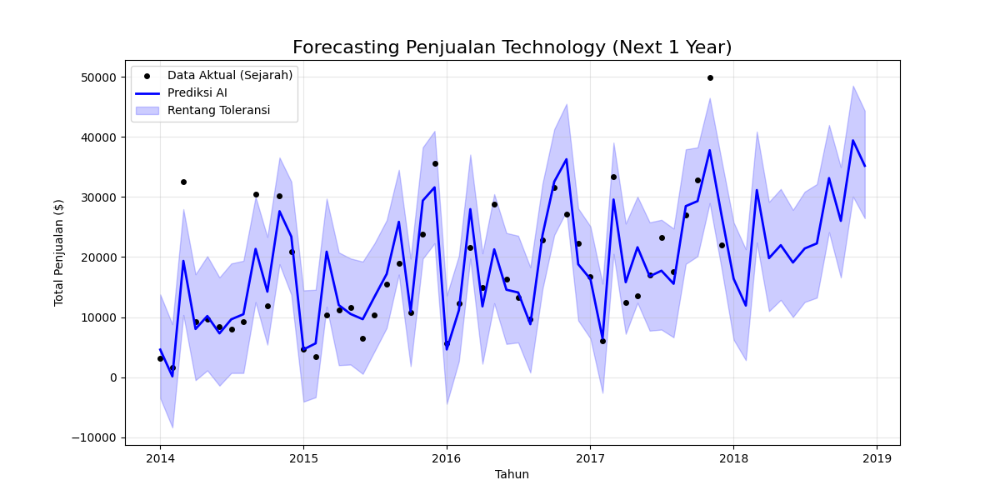
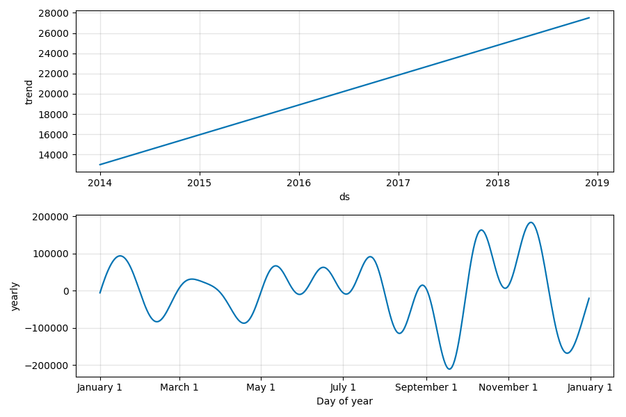

# 📦 Smart Inventory Forecasting AI

### 📌 Project Overview
In retail and export businesses, **Overstocking** kills cash flow, while **Understocking** kills revenue. This project solves that dilemma.

Using **Facebook Prophet (Time Series Forecasting)**, I analyzed 4 years of "Technology" category sales data to predict future demand and recommend precise **Safety Stock levels**.

### 💼 Business Value
* **Cash Flow Optimization:** Identified a massive seasonal dip in **February**, advising the business to reduce procurement by 40% during Q1 to save cash.
* **Revenue Maximization:** Detected a consistent surge in **November (Holiday Season)**, recommending a stock ramp-up in October to prevent stockouts.
* **Data-Driven Procurement:** Provided concrete financial targets for the next month (e.g., Target: **$16,377**, Safety Stock Buffer: **$6,226**).

### 🛠️ Tech Stack
* **Python:** Data Manipulation
* **Facebook Prophet:** Additive Regression Model for Forecasting
* **Pandas:** Time-series resampling (Monthly)

### 📊 Key Insights from AI
| Insight | Visualization |
| :--- | :--- |
| **The "Holiday Effect"** The model automatically detected a recurring sales spike in November. |  |
| **Growth Trend** Despite monthly fluctuations, the long-term trend remains positive. | *(See Trend Graph above)* |

---
*Created by Adin W Pratama*
